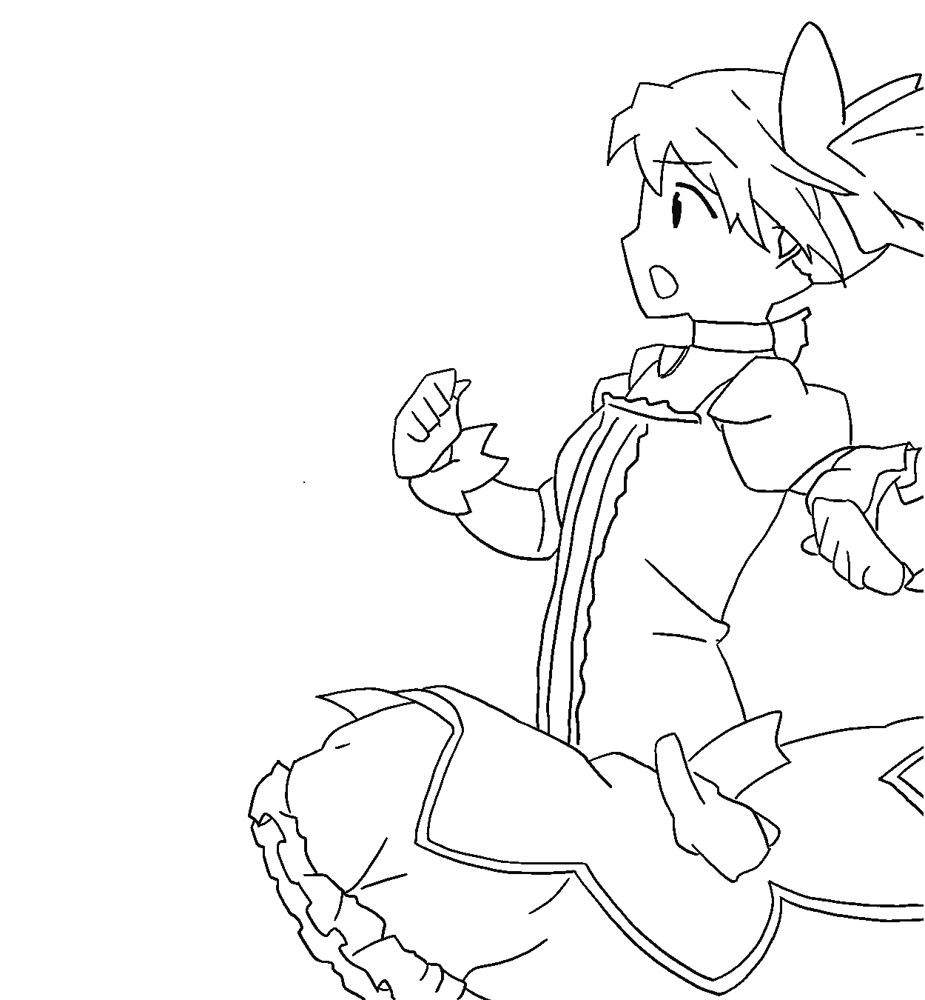

  

<h1 align="center">Hello, I'm Zirui Huang</h1>

  🎓 CS (Game Development) Master @ USC  
  🕹️ Aspiring Game Developer & Tech Artist  
  ✏️ Sketch enthusiast · 🎸 Guitar player · 🕺 Breakdancer  

<!-- Tech badges -->

  
  
  
  
  
  

<!-- Git Stats -->

  

  

  

